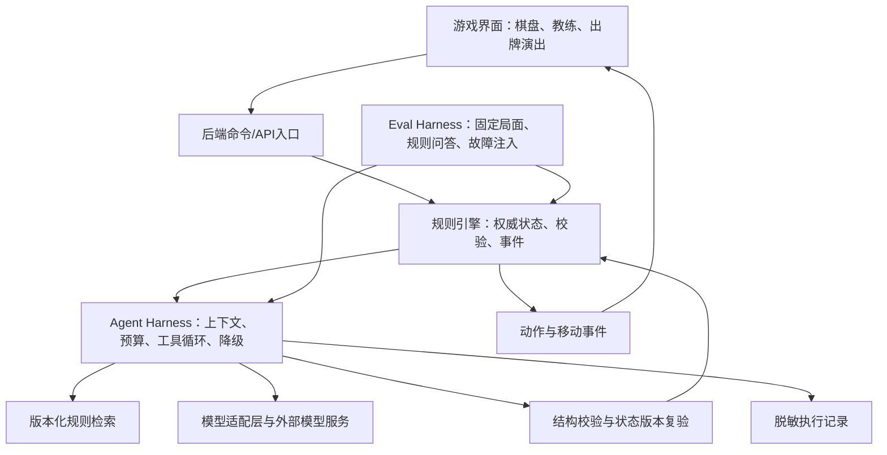

# 《当骰一棒》AI 融合方案 V2：课程需求与架构建议

日期：2026-09-26。状态：设计建议，未实现；不替换已确认的需求基线。

## 1. 本地证据与需求理解

已阅读 `.workbuddy/memory/2026-09-14.md`、`.workbuddy/memory/2026-09-20.md`、实验2与实验3、`docs/AI能力融合实施方案.md`、需求说明 V1、项目方案、协作记录及 `src/game` 中的实际实现。

- 实验2明确要求说明 AI 的输入、输出、价值、风险、人工确认点、非 AI 降级与验收样例。
- 实验3要求需求追踪、架构决策、职责边界、数据接口、异常流程与至少三张界面原型。其 2.1 明确写着“本阶段不要求确定 RAG、Agent 等具体实现方法”。
- 9月20日 WorkBuddy 记忆转述了课程融合 RAG 的新要求，并讨论了 Agent Harness、Eval Harness 与规则工坊。它是对话摘要，不是教师要求原文。
- 用户已于2026-09-26确认课程没有指定 Harness 产品或框架。本方案选择项目内轻量 TypeScript Harness，以可运行的工具循环、预算控制、校验、降级、轨迹和评估体现要求。
- 当前代码有规则 AI、规则引擎、地图和自动对局测试；尚无模型接入服务、RAG 索引或完整 Agent 工具层。使用 Codex/WorkBuddy 开发，不等于游戏本身已经具备大模型 Agent 能力。

## 2. 推荐定位与范围

推荐定位：**《当骰一棒》——具备规则知识检索、可解释智能对手与规则工坊的回合制桌游。**

第一交付闭环是“玩家提问规则 → 教练检索并引用 → 智能对手检索相关规则并选择合法行动 → 引擎执行 → 展示行动依据与结果 → 可查看评估记录”。

| 能力 | 玩家可见价值 | 优先级 |
| --- | --- | --- |
| 对手 Agent | 在路线和道具间选择，给出简短依据 | P0 |
| RAG 教练 | 回答规则问题，能指向具体规则条目 | P0 |
| Agent Harness | 模型慢或失败时对局仍可继续 | P0 基础设施 |
| Eval Harness | 用固定用例比较合法性、回答质量、延迟与表现 | P0 验收证据 |
| 自然语言规则工坊 | 玩家设计有限范围内的变体规则 | P1 差异化 |
| AI 解说 | 根据已发生事件生成简短战报 | P2，可先用模板 |

三个角色可以复用一个运行框架，不要求三个模型互相聊天。解说属于受约束生成任务，不能仅因调用模型就宣称它有完整自主 Agent 能力。

## 3. 需要纠正的旧方案假设

1. 引擎已有 `computeMoveTargets`、`canUseTool` 等函数，但没有覆盖所有道具和参数的统一合法行动列表。`canUseTool` 也不等于完整目标验证。须先实现统一命令入口，验证阶段、手牌归属、目标、参数、结束状态及请求版本；非法请求不得产生部分状态修改。
2. 不建议把“回合首动作”固定交给模型：普通首动作通常只是投骰。应在投骰后、有多个有意义选择的行动阶段调用模型；只有一个选项的步骤交程序处理。
3. 新增规则文本不能凭空增加引擎能力。“无需改代码”仅适用于已有规则原语的组合；全新效果仍需要实现引擎、显示和测试。
4. 不把全部 `docs/*.md` 自动作为玩家知识库。设计计划、旧版规则、协作笔记会混入尚未实现的功能；仅索引经过确认的规则、FAQ 和当前启用规则包。
5. 模型密钥只放后端环境变量，不使用前端 `VITE_*` 变量保存密钥。模型超时、成本、正确率应实测，不沿用“费用可忽略”“两天全部完成”等未验证结论。
6. 当前降级 AI 部分使用 `Math.random()`，不能称为完全确定性策略；随机源须可注入，以支持复现实验。

## 4. 建议架构

保留现有 Vue、TypeScript、Three.js。增加 Node.js/TypeScript 后端，与前端共享纯规则代码和命令类型。先完成单局权威状态与 AI 服务，再接真实多人房间；避免一开始同时重做联机与智能体。

建议边界：`src/game` 为纯规则；`server/agent` 为 Harness、角色策略与工具注册；`server/rag` 为索引和检索；`server/providers` 为模型适配；`knowledge` 为确认后的规则；`eval` 为评估数据与运行器。模块名是方案，不表示这些目录已存在。

### 对手 Agent 的一次决策

1. 获取本方可见局面与当前 `stateVersion`、`rulesetVersion`，隐藏对手未公开手牌。
2. 引擎枚举完整合法行动；数量过大时按类型分组，明确呈现筛选策略。
3. 按当前手牌、地形和规则包检索规则；支持只读 `get_rule`、`list_legal_actions`、`simulate_action` 工具。模拟须使用隔离状态和独立随机源，不能改变真实局面或消耗真实骰子序列。
4. 模型在有限轮工具调用后输出 `actionId`、一句可展示理由及 `sourceIds`，不要求或保存隐藏推理过程。
5. 复验动作、当前玩家及状态版本，通过后只执行一次。过期响应、重复响应、退出后的响应全部丢弃。
6. 超时、解析失败或非法输出时，由规则策略选择合法动作；如果无可执行动作，受控结束当前阶段。
7. 保存来源、耗时、模型标识、结果和降级原因；不保存密钥或任意用户隐私原文。

建议初始预算：每个 AI 回合最多一次有意义的模型决策；只读工具轮次有上限；总决策超时沿用需求 V1 的五秒目标，超时后两秒内产生降级动作。该数值是待测验收目标，动画播放时间另计。

动作演出独立于规则结算：事件依次播放“展示出牌 → 双骰结果或移动路径 → 效果 → 下一行动”。0.6×等动画倍速只影响播放，不能影响模型超时、随机值或权威回合期限。

## 5. RAG 实现与证明

知识源使用经确认的道具、地形、角色、阶段规则、FAQ 和启用规则包。每条记录包含 `id`、标题、正文、实体类型、来源、规则版本和生效范围。

按单条规则切片，优先实体/关键词匹配，再补语义向量检索；小规模索引可先用文件存储并在内存计算相似度。Embedding 服务与回答模型分别配置，不预设所有聊天接口都支持嵌入。

必须先按规则版本过滤，再检索；规则变更后增量更新索引。玩家问题可结合当前局面，但实时坐标、骰值和合法动作由引擎读取，不依赖静态知识库。回答引用的 ID 必须来自本次检索结果；找不到依据时明确说无法确认。

验收证据保留“问题 → 检索条目 → 引用 → 回答”。建立至少20条固定问句（普通规则、条件例外、规则组合、未知问题、旧版冲突），人工标注正确答案与预期来源；分别记录检索命中、答案正确、引用支持和无依据拒答。90%为目标，不能提前写成结果。

## 6. 规则工坊：推荐的扩展亮点

示例输入：“踩到幸运格时额外获得1点移动，每回合最多一次。”

流程：自然语言 → 模型提出受限规则草案 → Schema及语义校验 → 展示解释和示例 → 玩家确认 → 创建版本化规则包 → 下一局启用 → 同步索引 → 对手和教练读取相同版本。

先支持少量明确原语，例如进入格子/回合开始触发、地形条件、增减移动点效果。原语清单、触发先后、数值上下限、每回合次数上限、效果递归深度和冲突拒绝策略都由程序定义。禁止执行模型生成的 JavaScript；不能表示的规则明确拒绝。

首个可演示版本只需三种预设规则组合。真实难点在引擎执行和冲突处理，不在自然语言转 JSON。应先完成预设执行，再加入自然语言入口。

## 7. 评估与验收

对比三组：规则 AI、LLM 无检索、LLM 加检索。使用相同地图、玩家座位轮换、种子集合和预算；记录每组样本量。固定种子提升可复现性，但动作分歧可能改变随机调用序列，因此还应使用相同固定局面的单步评测；必要时为骰子和道具分别设置随机流。

指标包括：模型提议非法率、最终非法执行数、降级率、超时率、平均及P95决策延迟、实际 token 使用量、完赛率、平均回合数和胜率。成本仅在取得实际价格配置及usage后计算，缺失标为未知；模型提议非法率与最终非法执行数必须分开。

故障注入覆盖：不可解析输出、伪造行动ID、非法目标、服务失败、超时后迟到响应、重复提交、对局退出、规则版本变更、知识库缺失。目标是最终非法执行数为0、失败后可继续；这是测试目标，不是对实现正确性的无限保证。

## 8. 建议迭代顺序与答辩流程

| 迭代 | 可运行交付与验收 |
| --- | --- |
| A | 统一合法行动和命令入口、状态版本、可注入随机源；拒绝非法/重复命令且状态不变 |
| B | 后端模型适配与对手 Harness；真实模型选择一次有意义动作，断网自动降级 |
| C | 版本化规则库与带引用教练；对手和教练共用检索，保存固定问句评测 |
| D | 执行轨迹、评估报告与动画衔接；可比较三组策略，不假设LLM一定更强 |
| E | 受限规则工坊；预览确认后下一局执行，检索与引擎版本一致 |

课堂演示建议：正常人机对局 → 教练回答并展开来源 → 对手显示动作依据 → 故意关闭模型服务展示降级 → 查看评估报告。扩展演示再加入一条受支持的规则并验证其执行与问答一致。

后续实验3可直接据此设计需求追踪表、系统上下文图、总体架构图、命令与规则数据模型、正常/降级时序图，以及对局、教练、结果三张原型。既然课程未指定 Harness，优先采用项目内轻量实现，保留模型适配接口；本方案没有安装依赖或更改游戏代码。
